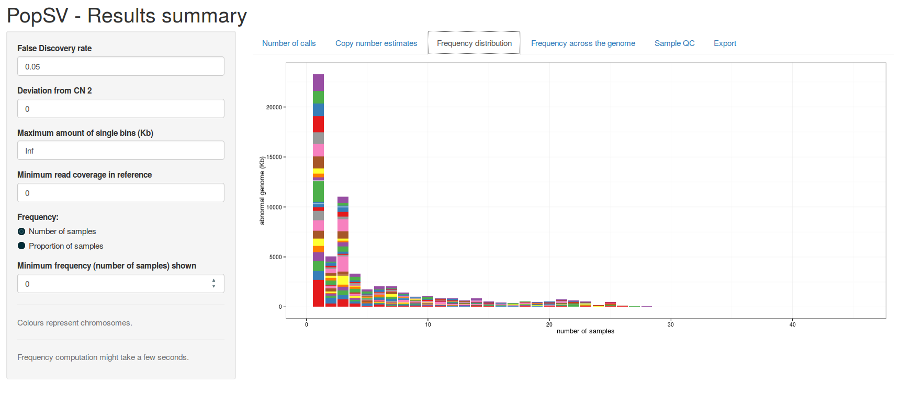

## Data quality before analysis

The most important quality control is to check the **homogeneity of the reference samples**. We perform this QC after counting the reads and GC bias correction. Have a look at the [Analysis Step](1-BasicWorkflow.md) for more details on its place in the workflow.

`qc.samples.cluster` runs the application. It takes as input a *data.frame* with bin counts across samples. Read counting has been done in each sample in the previous step. To merge the bin counts across samples in a few (e.g. 1000) bins, use `quick.count` function. The code looks like this:

```r
## Gets counts for all samples on a subset of 1000 bins
bc.rand = quick.count(subset(files.df, group=="normal"), bins.df, nb.cores=3, col.files="bc.gc.gz", nb.rand.bins=1e3)
## Run the web-application
qc.samples.cluster(bc.rand) 
```

*Here I assumed that my reference samples are defined by column 'group' in the `files.df` data.frame. Use directly `files.df` to look at all samples.*

The interface looks like this :


You can play with the number of clusters and cluster linkage approach. When you are satisfied, you can either:

+ Select the homogeneous cluster (*Cluster selected* field) and click on *Export selected cluster to 'ref-samples.RData'*.
+ Click on *Export clusters to 'samples-clusters.RData'*.

Once this is done, a new *.RData* file was created, you can load it and use it to filter outliers or focus on specific sample batches. 

Eventually if you have a lot of samples (good!) and you suspect the presence of technical batches (bad...), you could perform this QC before counting all the samples across all bins. This command will count reads only on a subset of 1000 random bins:

```r
bc.rand = quick.count(files.df, bins.df, nb.cores=3, nb.rand.bins=1e3)
```

Here, we didn't specify to use the GC corrected bin counts (`col.files="bc.gc.gz"` parameter before), so it will actually go to the BAM files and count the reads in 1000 random bins. Depending on your sample size, it might take some time and might be a good idea to use a cluster job (with [BatchJobs](2-ClusterManagement.md)).


## Summary of the calls

Once the calls for each sample have been merged, we can look at a number of simple metrics to get an idea of the quality. Usually, for normal samples we would expect:

+ The amount of called genome in each sample to be somewhat similar.
+ The copy number estimates to locate near integer values.
+ No systematic calls (i.e. called in all samples).

An interactive application is run using `sv.summary.interactive` function on the calls (output of `call.abnormal.cov` merged across samples).

```r
res.filt.df = sv.summary.interactive(res.df)
```

The interface looks like this:


On the left you see the four parameters you can tweak:

+ *False Discovery Rate*: significance threshold, reduce it to get higher confidence calls.
+ *Deviation from the CN 2*: how different a call should be compared to the estimated *C*opy *N*umber 2. Force a minimum deviation if you see calls too close to CN 2 (second tab).
+ *Maximum of single bins (Kb)*: automatically chooses a significance threshold that gives the specified maximum of genome affected by single-bin calls. Useful to force higher stringency for outlier samples (but keep them).
+ *Minimum read coverage in reference*: mappability threshold. Increase this number to remove calls in regions with low coverage in the reference samples.

The first tab looks at the amount of called genome in each sample. The bars can be colored in different ways. Clicking on *Colour by event size*, we get an idea of the amount of single bin called. 


This might be useful because outlier samples tend to show an excess of single-bin calls. That's the graph to look at if you need to tweak the *Maximum of single bins (Kb)* parameter.

Then we look at the copy number estimates.


We can play with the minimum number of consecutive bins. Keep in mind, we expect peaks at integer values for call with at least three consecutive bins. Lower than that, it's OK to have partial copy number estimates.



The frequency distribution can be good to check too. Here, it's a twin study, so the peak at 3-sample frequency is actually good (variant in twins + one parent). 


Finally, once you are satisfied click on the *Export results* button on the *Export* tab. This will return the filtered *data.frame* in R.

Eventually, if you just want the graphs, without the interactivity, use `sv.summary` instead. It will return a list of ggplots.

## Example of a region

The signal in a specific region across samples can be displayed in order to get a better feel of the call/variant.

For now the available functions are:

+ `coverage.plot.R` displays the bin coverage in a region, highlighting sample(s) of interest.
+ `coverage.plot.raw.R` reads the BAM files and display bp coverage of a region.
+ `cn.plot.R` displays the copy number estimates in a region.

*Examples soon...*

## Interactive breakpoint fine-tuning

PopSV calls are defined at the bin resolution, hence hundreds to thousands of bp. In order to fine-tune the breakpoints location we implemented an interactive app. 

`breakpoint.finder.interactive` takes as **input a genomic region, some samples and the path to the bam files**. It then opens an application in the web-browser where you can slide the breakpoints where desired. The interface looks like this:


```r
breakpoint.finder.interactive(chr.i, start.i, end.i, test.sample=test.samp, files.df=files.df, ref.samples=ref.samp)
```

Once you have decided on breakpoint location, you can hit the *Done* button and the function will **returns the final breakpoint location as well as the final graph**. In practice you might want to save this output, and maybe even loop across several regions:

```r
## Interactive breakpoint fine-tuning
bk.l = NULL
while(length(bk.l)<nrow(val.df)){
  ii = length(bk.l) + 1
  bk.l = c(bk.l, list(breakpoint.finder.interactive(val.df$chr[ii], val.df$start[ii], val.df$end[ii], val.sample[ii], files.df, ref.samples=controls.samp)))
}
## Merge results
bk.df = do.call(rbind, lapply(bk.l, function(ll)ll$bk.df))
## Final graph for each region
pdf("bkptResults.pdf",14,5)
lapply(bk.l, function(ll)ll$graph)
dev.off()
```

You can also specify related samples (e.g. parents) that will be displayed with a specific color. This might help understanding the mode of inheritance or veracity of the variant. It looks like this:


In practice, you **need access to the BAM files** and to **run it locally** (for the web-browser application). I would recommend to **mount** the cluster/server with the BAM files on your laptop. Then you might need to tweak a bit the paths in the *bam* column of `files.df` to include your mounting location.
