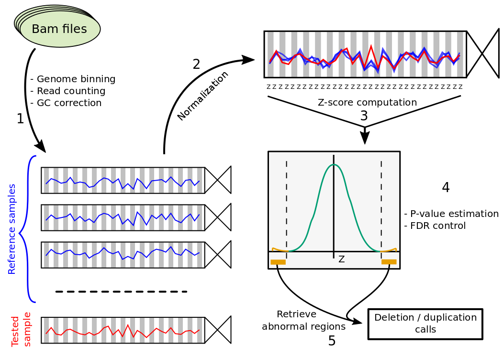

PopSV
=====

PopSV is a Copy-Number Variation (CNV) detection method from high-throughput sequencing. 
Abnormal Read-Depth signal is detected by using a population of samples as reference. Thanks to this population
view the whole genome can be robustly interrogated, including regions of low mappability. Moreover, any divergence from
the reference samples are detected, even if the signal is incomplete, e.g. tumoral aberrations or SV involving repeats.

**Warning: PopSV package is still in active development.**

### Installation
To install the latest development version: `devtools::install_github("jmonlong/PopSV")`. This requires `devtools` package (more information [here](https://github.com/hadley/devtools)) which can be easily installed with `install.packages("devtools")`. 

Some [Bioconductor](http://bioconductor.org/) packages are also necessary and not installed automatically. Running the following command should be sufficient :
```{r}
source("http://bioconductor.org/biocLite.R")
biocLite("BSgenome.Hsapiens.UCSC.hg19", "Rsamtools")
```

**R 3.1 or higher** is required.


### Workflow



First the genome is fragmented and reads mapping in each bin are counted for each sample and GC corrected (1). Next, coverage of the sample is normalized (2) and each bin is tested by computing a Z-score (3), estimating p-values (4) and identifying abnormal regions (5). 

A quick description of the different analysis steps and their corresponding functions can be found in [this page](1-BasicWorkflow.md).


### Running on computing clusters

PopSV workflow heavily uses [*BatchJobs* package](https://cran.r-project.org/web/packages/BatchJobs/index.html) to send computations to a cluster. It needs some configuration but then it saves a lot of time and the pipeline can be run easily. For more information on how to configure it and how the pipelines are using it go to [this page](2-ClusterManagement.md).

### FAQ

Find frequently asked questions [there](4-FAQ.md).
