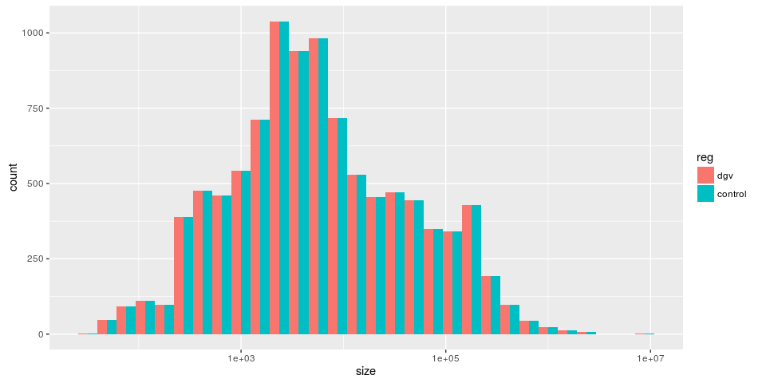
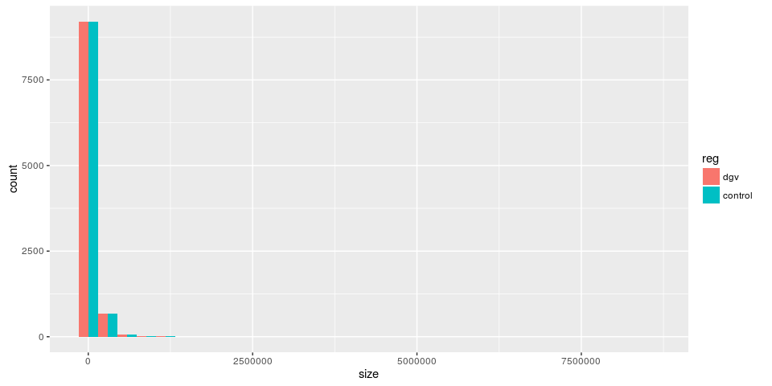
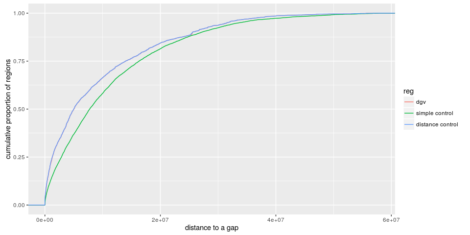

Constructing control regions for enrichment analysis
====================================================

Introduction
------------

When investigating enrichment in specific genomic features, it is common to compare the regions of interest with some controls regions. **A simple approach** to construct control regions could be to **randomly select regions across the genome**. Additionally, it is important for the control regions to have the **same size distribution**.

However, a random distribution across the genome is usually **not realistic**. Likely, regions in the genome were not tested because inaccessible or not included in the analysis. Moreover, **you might want to control for some patterns and look for more**.

For example, we first observed enrichment of CNVs in low-mappability regions. We then wanted to test additional enrichment in different repeat classes. Because repeats are enriched in low-mappability regions, repeats will likely be seen enriched in CNVs. We want to avoid spurious correlation and control for the low-mappability enrichment. By constructing control regions with the same low-mappability enrichment we can can test additional enrichment in the different repeat classes without being biased by the relation between low-mappability regions and repeats.

Constructing control regions with *PopSV* package
-------------------------------------------------

First we load the package and retrieve some annotations to play with.

``` {.r}
library(PopSV)
library(AnnotationHub)
ah = AnnotationHub()
genes = ah[["AH49010"]] ## Genes
dgv = ah[["AH5120"]] ## SVs from DGV
dgv = dgv[sample.int(length(dgv), 1e4)] ## Reduce to 10K random SVs
```

We imported a gene annotation and 10 thousands SVs from DGV. If we want to construct control regions that fit the SV size and overlap with genes, we run:

``` {.r}
dgv.cont = draw.controls(dgv, list(gene=genes), chr.prefix="chr")
```

Now let's verify that the size distribution is the same. By construction it should be **exactly** the same.

``` {.r}
library(ggplot2)
size.df = rbind(data.frame(reg="dgv", size=width(dgv)),
                 data.frame(reg="control", size=width(dgv.cont)))
ggplot(size.df, aes(x=size, fill=reg)) + geom_histogram(position="dodge")
```

<!-- -->

``` {.r}
ggplot(size.df, aes(x=size, fill=reg)) + geom_histogram(position="dodge") + scale_x_log10()
```

<!-- -->

And that the input and output regions **overlap** genes **similarly**. By default an **approximation** is used and might lead to small differences. To switch off the approximation see further down.

``` {.r}
mean(overlapsAny(dgv, genes))
```

    ## [1] 0.4015

``` {.r}
mean(overlapsAny(dgv.cont, genes))
```

    ## [1] 0.4015

`draw.controls` functions can **accept any number of genomic features to control**. Let's import two additional genomic annotation that we would like to control for our enrichment analysis: assembly gaps and segmental duplications.

``` {.r}
gap = ah[["AH6444"]]
segdups = ah[["AH5121"]]
dgv.cont2 = draw.controls(dgv, list(gene=genes, gap=gap, sd=segdups), chr.prefix="chr")
```

Again, the size distribution must be the same:

``` {.r}
## Same size distribution ?
size.df = rbind(data.frame(reg="dgv", size=width(dgv)),
                 data.frame(reg="control", size=width(dgv.cont2)))
ggplot(size.df, aes(x=size, fill=reg)) + geom_histogram(position="dodge")
```

<!-- -->

``` {.r}
ggplot(size.df, aes(x=size, fill=reg)) + geom_histogram(position="dodge") + scale_x_log10()
```

<!-- -->

And the overlap with the three different genomic annotations similar.

``` {.r}
## Same overlap with features ?
mean(overlapsAny(dgv, genes))
```

    ## [1] 0.4015

``` {.r}
mean(overlapsAny(dgv.cont2, genes))
```

    ## [1] 0.4015

``` {.r}
mean(overlapsAny(dgv, gap))
```

    ## [1] 0.0073

``` {.r}
mean(overlapsAny(dgv.cont2, gap))
```

    ## [1] 0.0073

``` {.r}
mean(overlapsAny(dgv, segdups))
```

    ## [1] 0.2075

``` {.r}
mean(overlapsAny(dgv.cont2, segdups))
```

    ## [1] 0.2066

If we had used the first set of control regions (only genes overlap control) the gap and segmental duplication overlap proportions wouldn't match.

``` {.r}
mean(overlapsAny(dgv.cont, segdups))
```

    ## [1] 0.0893

``` {.r}
mean(overlapsAny(dgv.cont, gap))
```

    ## [1] 0.1028

Controlling for the distance to a feature
-----------------------------------------

In addition to controlling for the overlap to a set of feature, `draw.controls` can also **control for the distance to one feature**. Although we can control for overlap to several feature the distance control is more complex to multiplex and for now we can only control for distance to one feature.

``` {.r}
dgv.cont3 = draw.controls(dgv, list(gene=genes, sd=segdups), chr.prefix="chr", dist.gr=gap)
```

Again, the size distribution must be the same:

``` {.r}
## Same size distribution ?
size.df = rbind(data.frame(reg="dgv", size=width(dgv)),
                 data.frame(reg="control", size=width(dgv.cont3)))
ggplot(size.df, aes(x=size, fill=reg)) + geom_histogram(position="dodge")
```

<!-- -->

``` {.r}
ggplot(size.df, aes(x=size, fill=reg)) + geom_histogram(position="dodge") + scale_x_log10()
```

<!-- -->

And the overlap with the three different genomic annotations similar.

``` {.r}
## Same overlap with features ?
mean(overlapsAny(dgv, genes))
```

    ## [1] 0.4015

``` {.r}
mean(overlapsAny(dgv.cont3, genes))
```

    ## [1] 0.4011

``` {.r}
mean(overlapsAny(dgv, segdups))
```

    ## [1] 0.2075

``` {.r}
mean(overlapsAny(dgv.cont3, segdups))
```

    ## [1] 0.2067

Finally let's check that we now control for the *distance* to a gap.

``` {.r}
## Same distance to gap ?
dist.df = rbind(data.frame(reg="dgv", dist=as.data.frame(distanceToNearest(dgv, gap))$distance),
    data.frame(reg="simple control", dist=as.data.frame(distanceToNearest(dgv.cont2, gap))$distance),
    data.frame(reg="distance control", dist=as.data.frame(distanceToNearest(dgv.cont3, gap))$distance))
ggplot(dist.df, aes(x=dist, fill=reg)) + geom_histogram(position="dodge") + xlab("distance to a gap")
```

<!-- -->

``` {.r}
ggplot(dist.df, aes(x=dist, colour=reg)) + stat_ecdf() + ylab("cumulative proportion of regions") + xlab("distance to a gap")
```

<!-- -->

Approximation or exact overlap ?
--------------------------------

In order to speed up the process, the input regions are grouped by size. Control regions are then built for each group using the average size. **This approximation leads to small differences between feature overlap with input and output regions**. It's **not a problem usually**, especially when the input regions have specific size patterns (e.g. CNVs from a binned genome).

If you want **to force the control regions to have exactly the same overlap with the feature, use** `nb.class=Inf`. However it will **take more time to compute**, especially if the size distribution of the input regions is very diverse. Of note the computation time also increases with additional features to control.

``` {.r}
system.time((dgv.cont.approx = draw.controls(dgv, list(gene=genes), chr.prefix="chr")))
```

    ##    user  system elapsed 
    ##  20.282   0.702  14.245

``` {.r}
system.time((dgv.cont.exact = draw.controls(dgv, list(gene=genes), chr.prefix="chr", nb.class=Inf)))
```

    ##    user  system elapsed 
    ##  85.745   0.734 100.623

``` {.r}
mean(overlapsAny(dgv, genes))
```

    ## [1] 0.4015

``` {.r}
mean(overlapsAny(dgv.cont.approx, genes))
```

    ## [1] 0.4018

``` {.r}
mean(overlapsAny(dgv.cont.exact, genes))
```

    ## [1] 0.4015

R session
---------

``` {.r}
sessionInfo()
```

    ## R version 3.2.3 (2015-12-10)
    ## Platform: x86_64-pc-linux-gnu (64-bit)
    ## Running under: Ubuntu 14.04.4 LTS
    ## 
    ## locale:
    ##  [1] LC_CTYPE=fr_CA.UTF-8       LC_NUMERIC=C              
    ##  [3] LC_TIME=fr_CA.UTF-8        LC_COLLATE=fr_CA.UTF-8    
    ##  [5] LC_MONETARY=fr_CA.UTF-8    LC_MESSAGES=fr_CA.UTF-8   
    ##  [7] LC_PAPER=fr_CA.UTF-8       LC_NAME=C                 
    ##  [9] LC_ADDRESS=C               LC_TELEPHONE=C            
    ## [11] LC_MEASUREMENT=fr_CA.UTF-8 LC_IDENTIFICATION=C       
    ## 
    ## attached base packages:
    ## [1] stats4    parallel  stats     graphics  grDevices utils     datasets 
    ## [8] methods   base     
    ## 
    ## other attached packages:
    ## [1] ggplot2_2.1.0        GenomicRanges_1.22.4 GenomeInfoDb_1.6.3  
    ## [4] IRanges_2.4.8        S4Vectors_0.8.11     AnnotationHub_2.2.3 
    ## [7] BiocGenerics_0.16.1  PopSV_1.0            rmarkdown_0.9.5     
    ## 
    ## loaded via a namespace (and not attached):
    ##  [1] Rcpp_0.12.3                       plyr_1.8.3                       
    ##  [3] futile.logger_1.4.1               BiocInstaller_1.20.1             
    ##  [5] formatR_1.2.1                     XVector_0.10.0                   
    ##  [7] futile.options_1.0.0              bitops_1.0-6                     
    ##  [9] tools_3.2.3                       zlibbioc_1.16.0                  
    ## [11] digest_0.6.9                      gtable_0.2.0                     
    ## [13] RSQLite_1.0.0                     evaluate_0.8                     
    ## [15] BSgenome_1.38.0                   shiny_0.13.1                     
    ## [17] DBI_0.3.1                         curl_0.9.6                       
    ## [19] yaml_2.1.13                       rtracklayer_1.30.2               
    ## [21] httr_1.1.0                        stringr_1.0.0                    
    ## [23] knitr_1.12.3                      Biostrings_2.38.4                
    ## [25] grid_3.2.3                        data.table_1.9.6                 
    ## [27] Biobase_2.30.0                    R6_2.1.2                         
    ## [29] BSgenome.Hsapiens.UCSC.hg19_1.4.0 AnnotationDbi_1.32.3             
    ## [31] XML_3.98-1.4                      BiocParallel_1.4.3               
    ## [33] lambda.r_1.1.7                    magrittr_1.5                     
    ## [35] scales_0.4.0                      GenomicAlignments_1.6.3          
    ## [37] Rsamtools_1.22.0                  htmltools_0.3                    
    ## [39] SummarizedExperiment_1.0.2        colorspace_1.2-6                 
    ## [41] mime_0.4                          interactiveDisplayBase_1.8.0     
    ## [43] xtable_1.8-2                      httpuv_1.3.3                     
    ## [45] labeling_0.3                      stringi_1.0-1                    
    ## [47] munsell_0.4.3                     RCurl_1.95-4.8                   
    ## [49] chron_2.3-47
